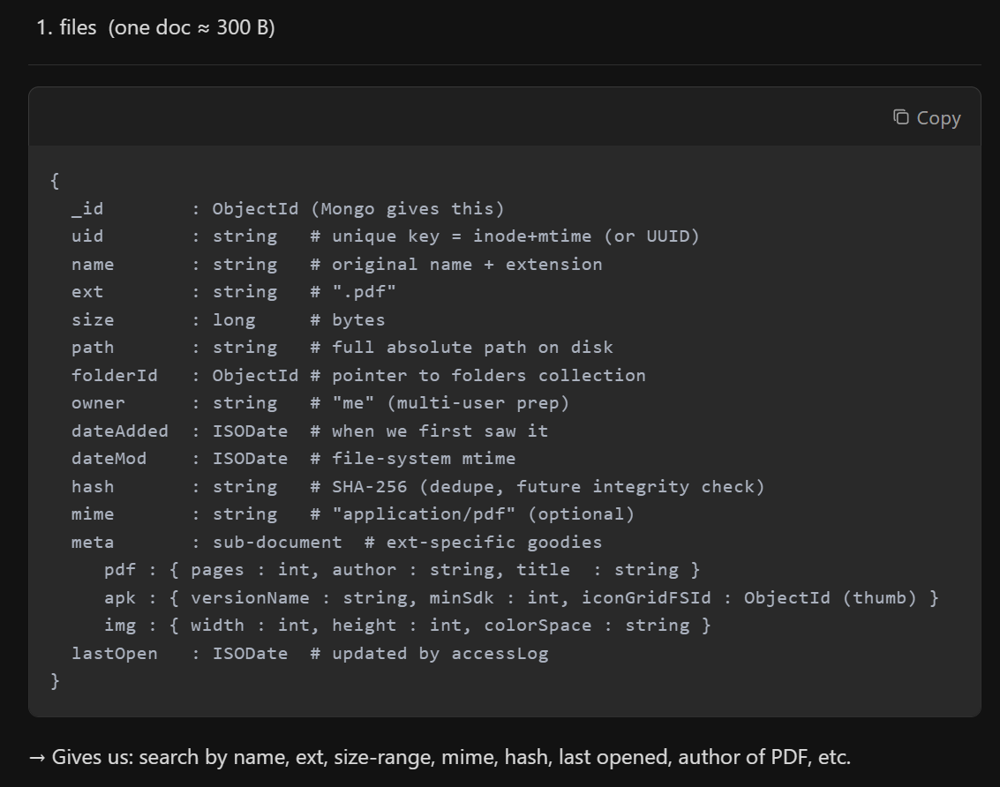
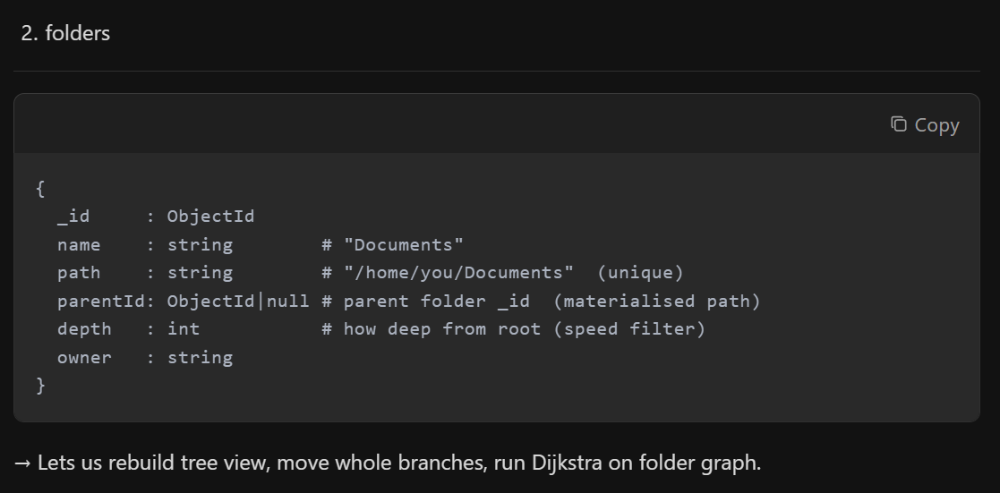
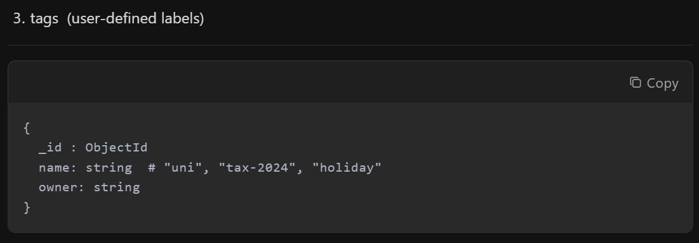
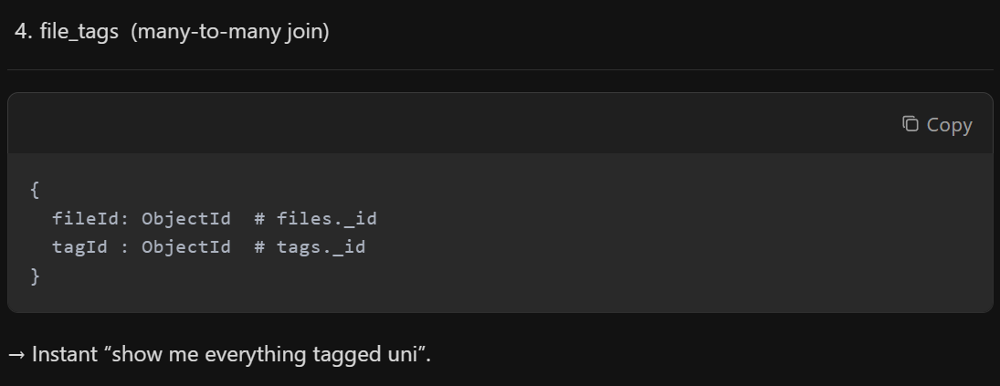
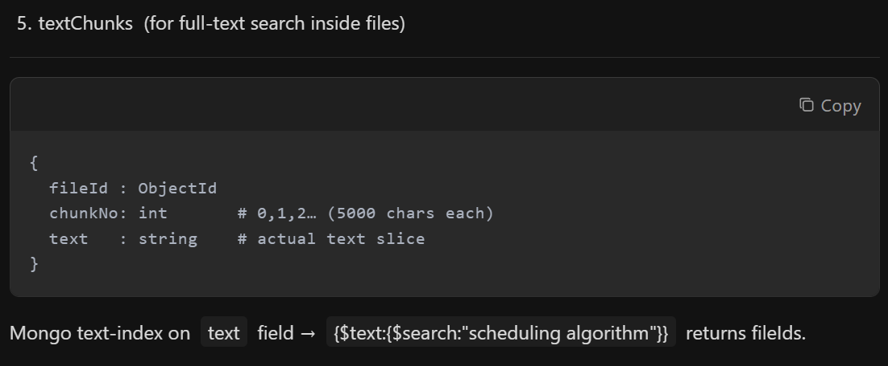
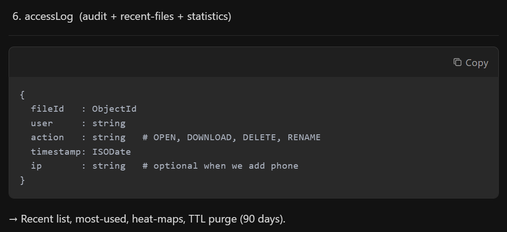
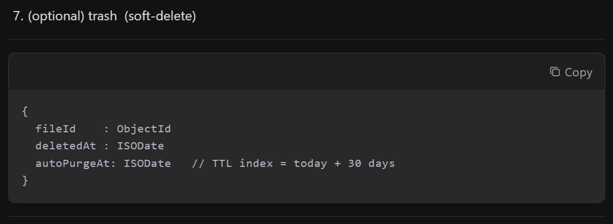

# MongoDB Project about a file explorer/searcher

## 1.  files (one doc ≈ 300 B)

```
{
  _id        : ObjectId (Mongo gives this)
  uid        : string   # unique key = inode+mtime (or UUID)
  name       : string   # original name + extension
  ext        : string   # ".pdf"
  size       : long     # bytes
  path       : string   # full absolute path on disk
  folderId   : ObjectId # pointer to folders collection
  owner      : string   # "me" (multi-user prep)
  dateAdded  : ISODate  # when we first saw it
  dateMod    : ISODate  # file-system mtime
  hash       : string   # SHA-256 (dedupe, future integrity check)
  mime       : string   # "application/pdf" (optional)
  meta       : sub-document  # ext-specific goodies
     pdf : { pages : int, author : string, title  : string }
     apk : { versionName : string, minSdk : int, iconGridFSId : ObjectId (thumb) }
     img : { width : int, height : int, colorSpace : string }
  lastOpen   : ISODate  # updated by accessLog
}
```

## 2.  folders

```
{
  _id     : ObjectId
  name    : string        # "Documents"
  path    : string        # "/home/you/Documents"  (unique)
  parentId: ObjectId|null # parent folder _id  (materialised path)
  depth   : int           # how deep from root (speed filter)
  owner   : string
}
```

## 3.  tags (user-defined labels)

```
{
  _id : ObjectId
  name: string  # "uni", "tax-2024", "holiday"
  owner: string
}
```

## 4.  file_tags (many-to-many join)

```
{
  fileId: ObjectId  # files._id
  tagId : ObjectId  # tags._id
}
```

## 5.  textChunks (for full-text search inside files)

```
{
  fileId : ObjectId
  chunkNo: int       # 0,1,2… (5000 chars each)
  text   : string    # actual text slice
}
```

## 6.  accessLog (audit + recent-files + statistics)

```
{
  fileId   : ObjectId
  user     : string
  action   : string   # OPEN, DOWNLOAD, DELETE, RENAME
  timestamp: ISODate
  ip       : string   # optional when we add phone
}
```

## 7.  (optional) trash (soft-delete)

```
{
  fileId    : ObjectId
  deletedAt : ISODate
  autoPurgeAt: ISODate   // TTL index = today + 30 days
}
```

















### Possible Additions With Regards to DSA:

1.  `AVL-tree` (or `Red-Black`) – SIZE INDEX
    *   **Use-case**: “Top 100 biggest files”, “everything between 50 MB and 200 MB”
    *   **Implementation**:
        *   Key = file size (`uint64_t`), value = file UID
        *   Insert / delete / update when Watchdog notices a change
        *   In-order walk → already sorted, O(log n)
        *   Python glue: `top_biggest(100)` returns UIDs in milliseconds without touching Mongo.

2.  `Hash-Table` (`unordered_map`) – PATH → UID CACHE
    *   **Use-case**: Watchdog gives us a full path; we need the UID immediately to update / delete
    *   **Implementation**:
        *   `unordered_map<string, string> pathToUid`
        *   Updated on insert / rename / delete
        *   O(1) lookup instead of a Mongo query every event

3.  `Graph` + `Dijkstra` – FOLDER SHORTEST PATH
    *   **Use-case**: “Move this file to Backup” – suggest shortest folder route
    *   **Implementation**:
        *   Nodes = folders, edges = parent-child, weight = 1
        *   Build adjacency list once (scan phase)
        *   Dijkstra gives shortest path; show user a button “Move along 3-folder route”

4.  `Merge-Sort` / `Quick-Sort` – CLIENT-SIDE SORTING
    *   **Use-case**: user clicks “Sort by size” or “Sort by date”
    *   **Implementation**:
        *   Pull UIDs + key from Mongo once, push into `vector<pair<Key, UID>>`
        *   Your own `mergeSort()` or `quickSort()` → reorder vector
        *   GUI refreshes rows – no extra DB hit
